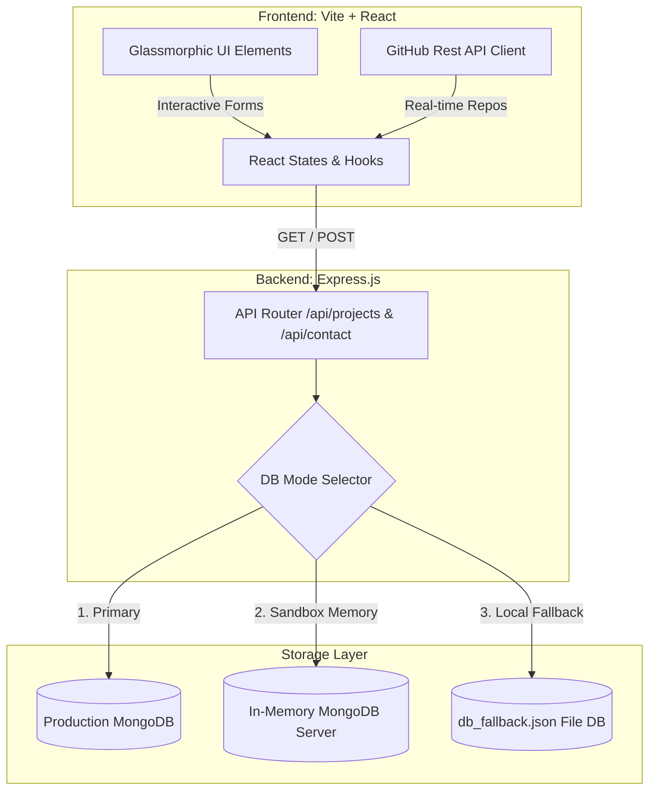

# Product Requirements Document (PRD)
## Saravanaselvi: Professional MERN Portfolio Showcase

| Attribute | Value |
| :--- | :--- |
| **Document Status** | Approved / Operational |
| **Owner** | Saravanaselvi |
| **Target Audience** | Recruiters, Engineering Managers, Tech Leads, Collaboration Partners |
| **Tech Stack** | React (Vite) + Node.js/Express + MongoDB (Mongoose) / Fallback |
| **Last Updated** | July 2, 2026 |

---

## 1. Product Overview & Vision
The **Saravanaselvi Portfolio Showcase** is a high-performance, single-page application (SPA) engineered to demonstrate a dual proficiency in **Full-Stack Software Engineering (MERN)** and **Agile Project Coordination/Operations Support**. 

Unlike standard portfolio templates, this application is styled as an elite, glassmorphic technical console. It reflects the owner's background (B.Tech in Electronics & Communication, 2022) by highlighting embedded controller experience alongside modern web application engineering. The portal incorporates interactive components—such as a mock Cloud Console deployment terminal and a verified compliance registry—to deliver an immersive and professional user experience.

---

## 2. Product Goals & Objectives

### 2.1 Core Goals
* **Professional Positioning**: Establish the owner's capability to bridge technical execution (React/Node.js) and project management metrics (Agile pipelines, ClickUp/JIRA sprint control).
* **Resilient Architecture**: Provide a robust MERN stack backend that remains functional under any hosting constraint (using a layered database fallback mechanism).
* **Interactive Engagement**: Showcase technical abilities dynamically through a live-updating portfolio grid integrated with real-time GitHub repository data.

### 2.2 Out of Scope (Phase 1)
* **Real Payment Integrations**: Billing systems or real Zoho Books endpoints (mocked metadata is used).
* **Multi-tenant Project Administration**: Admin login via OAuth is deferred; currently handled by the Cloud Console terminal widget.

---

## 3. High-Level System Architecture

The application is structured as a decoupled client-server architecture:



### Database Resilience Design
The backend is configured with an automated multi-tier storage fallback system:
1. **Primary**: Connects to a cloud-hosted MongoDB instance via `MONGODB_URI`.
2. **Secondary**: Automatically spins up an in-memory database server (`mongodb-memory-server`) for sandbox/testing environments.
3. **Tertiary (Offline Fallback)**: Automatically falls back to a file-based JSON structure (`db_fallback.json`) on the local filesystem if both MongoDB systems are unavailable.

---

## 4. Functional Specifications

### 4.1 Navigation Header (Navbar)
* **Visual Styling**: Glassmorphic bar (`backdrop-blur-md`) pinned to the top of the viewport with a subtle slate border.
* **Sections Included**: About, Experience, Skills, Projects, and Contact.
* **Responsive Control**: Mobile hamburger menu collapses gracefully on smaller viewports.

### 4.2 Hero & Introduction Section
* **Status Widget**: A monospaced micro-badge indicating active availability: `"Specialized Engineering & Project Sprint Control"` with an emerald pulsing dot.
* **Typography**: Large, bold headings using gradient typography transitioning from emerald-400 to cyan-400.
* **Asymmetrical Information Widgets**:
  * **Core Engineering Widget**: Displays hardware specialization (Electronics & Communication, embedded controllers, logic).
  * **Sprint & Delivery Widget**: Highlights project management skills (JIRA, ClickUp, timelines).

### 4.3 Professional Journey (Experience Section)
* **Design**: Vertical chronological timeline using SVG nodes (`Briefcase` icons) and glowing active states.
* **Information Structure**: Details professional roles including Lymdata Labs Pvt. Ltd., GD Innovative Solutions, and Spengeotec Pvt. Ltd.
* **Bullet Points**: Action-oriented highlights demonstrating requirement capturing, agile sprint coordination, Zoho Books invoice pipelines, and React layout styling.

### 4.4 Competency & Execution Matrix (Skills Section)
* **Categorized Competency**:
  * **MERN & Full-Stack**: React.js, Node.js, Express.js, MongoDB, Tailwind CSS, REST APIs, and Antigravity framework.
  * **Agile Operations**: JIRA, ClickUp, Trello, SDLC Integration.
  * **Data & Business**: SEO Reporting, Zoho Books, HubSpot CRM.
* **Verified Compliance Registry**: Displays specialized GUVI HCL Zen Class certifications in React, Node, Database Engineering, and Advanced JS, complete with an authentication badge status.

### 4.5 Projects Showcase & Filter Console
* **Dynamic Tab Filtering**: Filter projects by categories: `All`, `MERN Stack`, `Engineering`, and `Automation`.
* **API Integration**: Aggregates internal projects (loaded from Express backend API) with real-time public repositories fetched from the GitHub API (`saravanaselvi2705`).
* **Source & Live Links**: Links to GitHub source repositories and live demonstration URLs when available.

### 4.6 Cloud Console Terminal Modal (`deploy --project`)
* **Trigger**: A console-style action button styled as `deploy --project`.
* **Terminal UI Simulation**: Launches a dark, monospaced window with simulation controls (red/yellow/green header buttons).
* **Live Deployment Log**: Shows real-time deployment steps:
  ```bash
  saravanaselvi@aws-console:~$ npm run deploy
  >> [SYSTEM] Initiating project deployment sequence...
  >> [SYSTEM] Checking database state (mongoose fallback check)...
  >> [REGISTRY] Verifying compliance integrity codes...
  >> [API] POST /api/projects payload: "..."
  >> [SUCCESS] Deployment completed successfully! Reloading grid...
  ```
* **Forms & Submissions**: Submits a new project record directly to the backend database, instantly refreshing the frontend showcase container.

### 4.7 Contact Capture Form
* **Fields**: Name (string), Email (validated via regex), and Message (textarea).
* **Alert States**: Success toasts and red validation error banners embedded inside the contact layout.

---

## 5. Non-Functional & Design Requirements

### 5.1 Aesthetic Architecture
* **Theme**: Deep Obsidian & Emerald (`#030712` background, slate panel fills, and emerald-400 / cyan-400 accent highlights).
* **Micro-Animations**: Smooth scale transforms on hover (`scale-102`), border color transitions on card panels, and pulsing ping animations on live indicators.
* **Interactive Elements**: Unique pointer styling and button feedback transitions to enhance tactile click responses.

### 5.2 Performance & SEO
* **Build Engine**: Vite for fast hot module replacement (HMR) and optimized build bundles.
* **Semantic Markups**: Single main `<h1>` title structure with proper nested structural headings.
* **SEO Metadata**: Unique page title, descriptions, and structural tags targeting engineering, MERN developer, and agile project coordinator keywords.
